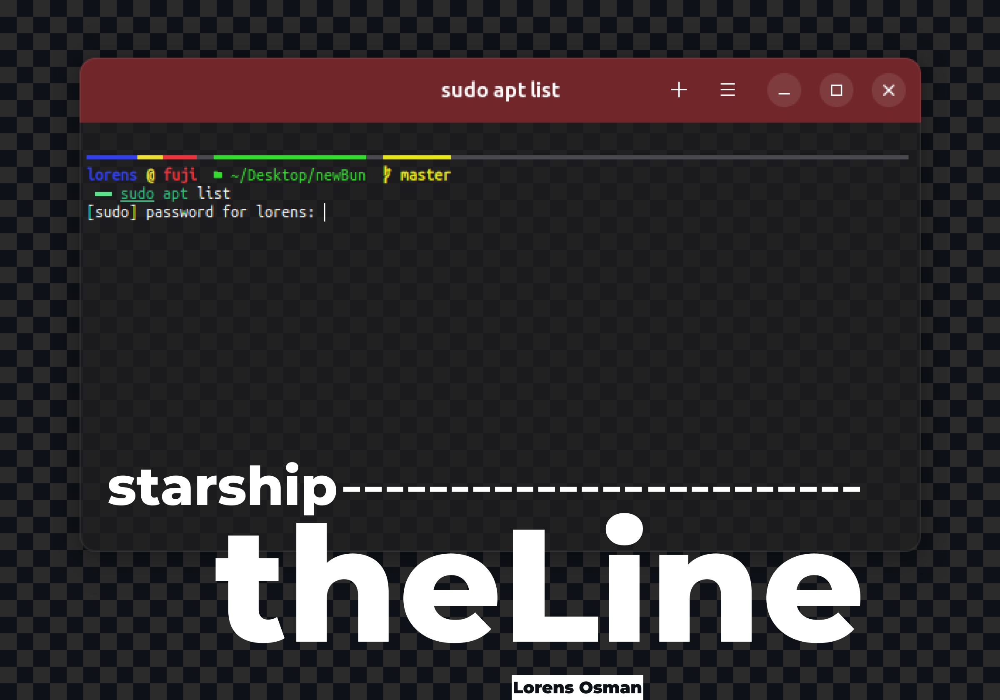

# Starship_theLine is a neat theme colection designed for [Starship](https://starship.rs/) prompt.


### 🧩 Prerequisites
 *To replicate the terminal appearance as shown in the screenshots, please follow all the following steps. Otherwise, you may skip steps 1 and 2.*
1. **[Ubuntu Mono Nerd Font Regular ](https://github.com/ryanoasis/nerd-fonts/tree/master/patched-fonts/UbuntuMono/Regular)**
Or  **[Fira Code Nerd Font Regular](https://github.com/ryanoasis/nerd-fonts/tree/master/patched-fonts/FiraCode/Regular)** 

> [**Nerd Fonts**](https://github.com/ryanoasis/nerd-fonts/tree/master) is a project that patches developer targeted fonts with a high number of glyphs (icons), Specifically to add a high number of extra glyphs from popular 'iconic fonts' such as Font Awesome, Devicons, Octicons, and others.

2. **Black Box Terminal**: [**install and configure Black Box**](install%20Black%20Box.md) 
3. **Z Shell (ZSH)** : [**install zsh**](install%20ZSH.md) 
4. [Starship](https://starship.rs/) prompt
5. Configure starship_theLine theme
### ⚙️ Configure starship_theLine theme
1. Open any text editor
2. Copy the next :
```toml
#--------[ LORENS OSMAN ]--------#


#--------[ starship_theLine ]

format = """
${custom.user}\
[━━━](#eddf31 bold)\
${custom.host}\
[━━](fg:#4b494f bold)\
${custom.dir}\
[━━](fg:#4b494f bold)\
${custom.git}\
$fill\
$line_break\
$username\
$hostname\
${custom.directory}\
[ ](fg:#4b494f bold)\
$git_branch\
$line_break\
$character
"""


#--------[CUSTOM COMMANDS]

[custom.directory]
description = "Replace the default directory command"
command = """echo "${PWD/$HOME/~}" """
style = "fg:#33dd2d "
format = "[  󰉋 $output]($style)"
when = "true"

[custom.dir]
description = "the line above custom directory "
command = """echo $(pwd | sed "s|$HOME|~|") | wc -m | tr -d '\\n' | xargs -I {} seq -s '━' {} | tr -d '[:digit:]' """
style = "fg:#33dd2d"
format = "[━━$output]($style)"
when = "true"

[custom.user]
description = "the line above username"
command = "echo $USER  2>/dev/null | wc -m | tr -d '\\n' | xargs -I {} seq -s '━' {} | tr -d '[:digit:]' "
style = "#313fed bold"
format = "[$output]($style)"
when = "true"

[custom.host]
description = "the line above hostname"
command = "echo $HOST  2>/dev/null | wc -m | tr -d '\\n' | xargs -I {} seq -s '━' {} | tr -d '[:digit:]' "
style = "red bold"
format = "[$output]($style)"
when = "true"

[custom.git]
description = "the line above branch name"
command = "git rev-parse --abbrev-ref HEAD 2>/dev/null | wc -m | tr -d '\\n' | xargs -I {} seq -s '━' {} | tr -d '[:digit:]'| awk '{print $0 \"━━\"}'"
when = "git rev-parse --abbrev-ref HEAD 2>/dev/null"
shell = ["bash", "--noprofile", "--norc"]
style = "fg:#e5e513"
format = "[$output]($style)"


#--------[COMMANDS]

[username]
style_user = '#313fed bold'
style_root = 'black bold'
format = '[$user]($style)[ @ ](#eddf31 bold)'
disabled = false
show_always = true

[hostname]
ssh_only = false
format = '[$ssh_symbol](bold blue)[$hostname](bold red)'
trim_at = '.companyname.com'
disabled = false

[fill]
symbol="━"
style = "fg:#4b494f bold"

[line_break]
disabled = false

[character]
success_symbol ='[ ━━](bold green)'
error_symbol ='[✖ ](bold red)'

#--------[GIT COMMANDS]

[git_branch]
symbol = " "
style = "bold fg:#e5e512"
format = "[ $symbol$branch(:$remote_branch) ]($style)"


```
3. Save the file in `toml` format, with the name `starship_theLine.toml`
4. Open the `.zshrc` file using any text editor
5. Before the line `eval "$(starship init zsh)"` add the line `export STARSHIP_CONFIG=~/path/starship_theLine.toml` Be sure to replace `path` with the actual location where you saved the `starship_theLine.toml` file
6. Reload your terminal
7. Enjoy!
### 🖼️ Screenshots


### 🤩🪄 Other flavors

- [theLine_CHIN](theLine_CHAIN.md)
- [theLine_HEAVY](theLine_HEAVY.md)
- [theLine_MINMAL](theLine_MINIMAL.md)
- [theLine_DASHED](theLine_DASHED.md)
- [theLine_2LINE](theLine_2LINE.md)


---
 Our inspiration came from the following project
[Headline ZSH Theme](https://github.com/Moarram/headline)

